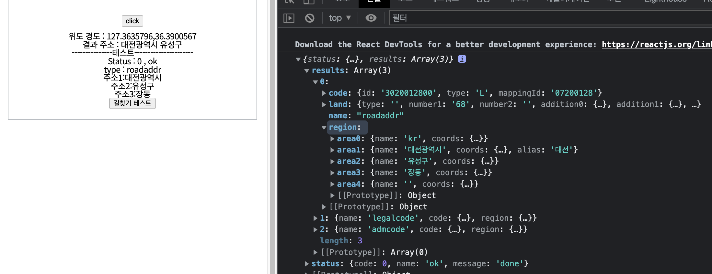
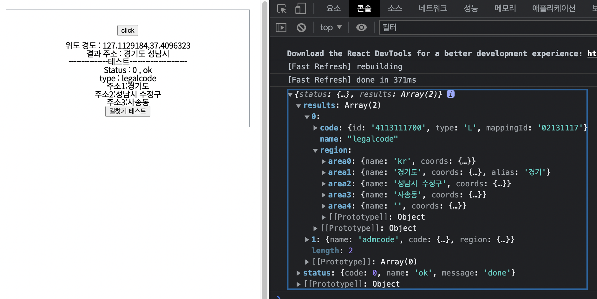
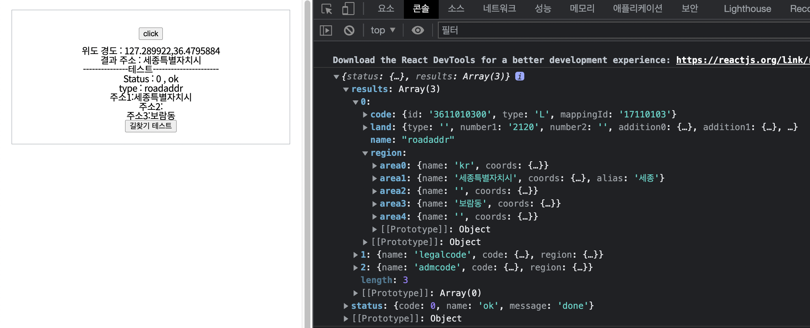

# Lab

프로젝트 시작 전 필요로 할 것 같은 기능 및 테스트

---

# GetCurrentLocate

좌표에 해당하는 주소를 받아오는 기능

1.  현재 위치의 좌표값을 받아와서
2.  Naver Reverse Geocoding Api으로 결과값을 받아와서
3.  주소 추출

# 0. Setting

```javascript
interface geoDataType {
  coords: string; // "longtitude,latitude"
  address1: string; // 추출한 시 도
  address2: string; //추출한 군 구
  data: any; //api 결과값 데이터
  length: number; // 결과값의 data.length
}
const datainit: geoDataType = {
  coords: null,
  address1: null,
  address2: null,
  data: null,
  length: 0,
};
let coords = "";
const [data, setData] = useState < geoDataType > datainit;
```

-- 해당 페이지에서만 사용할 예정이라 export 안하고 내부에서만 Type 사용  
-- coords의 경우 값이 계속 변할 예정이기에 const가 아닌 let  
-- useState로 GeoData 관리

# 1. 현재 위치 주소 받기

```javascript
// navigator 성공시
const success = (position) => {
  coords = `${position.coords.longitude},${position.coords.latitude}`;
  setData({ ...data, coords: coords });
};
// navigator 실패시
const error = (error) => {
  setData({
    ...data,
    address1: "-",
    address2: "-",
  });
};
// navigator 실행
const findingAddress = () => {
  let options = {
    enableHighAccuracy: true,
    timeout: 30000,
    maximumage: 1000,
  };
  navigator.geolocation.getCurrentPosition(success, error, options);
};
```

options의 경우 추가 기능으로 <a>https://developer.mozilla.org/en-US/docs/Web/API/Geolocation/getCurrentPosition</a>에서 확인

성공시 해당 위치의좌표값을 가져와서 성공한다.

그리고 여기서 생겼던 문제들

---

## window is not defined

해당 문제의 경우 next.js에서 SSR 할때 페이지 렌더링시 window, documet 전역 개체가 없다.  
그런데 렌더링 전에 window 로컬 스토리지에 접근하기에 undefined 참조 오류가 발생한다.  
사실 위의 1번의 경우 렌더링 이후 버튼 onClick을 통해 navigator를 호출하기때문에 요류는 발생하지 않으나 렌더링 시 불러오게 될 경우 문제가 발생할 수 있다.

## window 참조 해결법

```javascript
if (typeof window !== "undefined" && typeof window.navigator !== "undefined") {
  navigator.geolocation.getCurrentPosition(success, error, options);
}
```

typeof를 이용하여 window유무를 확인하여 navigator를 확인하여, 실행 가능하게 될때부터 호출

---

## getCurrentPosition() and watchPosition() no longer work on insecure origins. To use this feature, you should consider switching your application to a secure origin, such as HTTPS.

기능 구현 테스트할때는 localhost에서 연습하기 때문에 몰랐는데 build후 라던가 배포하고 나서 이후에 알게된 문제점  
해당페이지가 http://abcd.com 형태인 경우 현재 위치를 불러올수 없는 문제  
<a>https://medium.com/witinweb/http-프로토콜-사용시-html5-geolocation-api-등-위치정보-사용제한에-대하여-e024772cc280</a>  
요약하자면 보안 이슈로 인해 localhost를 제외한 http:// 에서는 사용 불가능  
해당 프로젝트는 https로 배포될 예정이기에 자연스럽게 해결

# 2. Naver Reverse Geocoding Api로 결과값 받아오기

```javascript
/**
 * reverseGeo 주소 찾기
 * @param coords "longtitude,latitude" 형태 ex) "127.12,36,232"
 * @returns api orders에 적은 순서대로 가능한 결과값 리스트 // return 잠시 보류
 */

export const _aGetReverseGeoLocation = async (coords: string) => {
  const res = await axios
    .get(
      `/reversegeo?coords=${coords}&output=json&orders=roadaddr,legalcode,admcode`,
      {
        headers: {
          "X-NCP-APIGW-API-KEY-ID": process.env.NEXT_PUBLIC_NAVER_CLIENT_ID,
          "X-NCP-APIGW-API-KEY": process.env.NEXT_PUBLIC_NAVER_CLIENT_SECRET,
        },
      }
    )
    .then((res) => res.data);

  return res;
};

const getReverseGeoLocation = useQuery(
  ["getReverseGeoLocation"],
  () => _aGetReverseGeoLocation(coords),
  {
    enabled: false,
    onError: (e) => {
      coords = "";
    },

    onSuccess: async (res: reverseGeocodingResponse) => {
      if (res.status.code !== 0) {
        coords = "";
        return false;
      }
      const result = getAddressFromGps(res);

      if (result !== undefined) {
        setData({
          ...data,
          address1: result.address.split(" ")[0],
          address2: result.address.split(" ")[1],
          data: res,
          length: res.results.length,
        });
      }
    },
  }
);
```

해당 Client Id, secret은 네이버 클라우드 api에서 셋팅후 axios 설정,
userQuery로 axios 결과값 관리  
getAddressFromGps()의 경우 JSON으로 돌아온 값을 프로젝트에 맞게 주소값 을 시,도,군,구만 빼는 임의의 함수이다. ex) 대전광역시 유성구

```javascript
/**
 * address from gps (naverApi)
 * @param data 네이버 reversegeo로 받아온 success data
 * @returns
 */
export const getAddressFromGps = (data: reverseGeocodingResponse) => {
  interface address {
    address: string;
  }
  let address;

  if (data.results[0].region.area1.name != "") {
    address = data.results[0].region.area1.name;
  }
  if (data.results[0].region.area2.name != "") {
    address = address + " " + data.results[0].region.area2.name;
  }

  return { address: address };
};
```

# 3. 검사소 리스트 CSV to JSON, 시도 군구 JSON 제작

```javascript
export interface CarCenterListType {
  trial: string;
  city: string;
  stationName: string;
  stationNum: string;
  stationAddr: string;
  "정기검사 여부"?: boolean;
  "종합검사 여부"?: boolean;
  "종합(대형) 여부"?: boolean;
  "이륜차검사 여부"?: boolean;
}

export const carCenterList: CarCenterListType[] = [
  {
    trial: "서울",
    city: "도봉",
    stationName: "xxxxxxxxxxxx",
    stationNum: "02-000-0000",
    stationAddr: "서울특별시 도봉구 ~~~~~ ~~~~~",
    "정기검사 여부": true,
    "종합검사 여부": true,
    "종합(대형) 여부": true,
    "이륜차검사 여부": true,
  },
  ....
]
```

csv 파일을 에서 JSON 변환후 필요에 맞게 변형,및 해당 trial, city에 해당하는 시 도 군 구 리스트 생성

```javascript
/** 전국? 리스트 */
export interface SubRegion {
  key: number;
  subName: string;
  subValue: string;
  COM?: boolean; // 종합부하 유무
}

export interface MainRegionlist {
  key: number;
  mainName: string;
  mainValue: string;
  subMenu: SubRegion[];
}

export const regionList: MainRegionlist[] = [
  {
    key: 0,
    mainName: "서울특별시",
    mainValue: "서울",

    subMenu: [
      {
        key: 0,
        COM: true,
        subName: "",
        subValue: "",
      },
      {
        key: 1,
        subValue: "강남",
        COM: true,
        subName: "강남구",
      },
      ...
    ]
  }
```

# 4. 결과


현재 위치로 설정확인시 api 결과값의 시도 군구 와 JSON 시도 군구가 같은 값을 출력

---

## 해결한 문제점 : 특정 지역에서 선택이 되지 않는 문제

해당 문제의 경우 api 결과값이 어떻게 넘어오는가를 확인해봐야하는 작업이 필요했다.

### **첫 테스트 시 이상적인 return값**



area1이 해당 시,도 area2의 경우 해당 군,구이며 깔끔하게 떨어지는 형태  
테스트 또한 대전광역시 내에서만 테스트를 하였기에 불러올 때 바로 area1, area2 값을 JSON과 비교 하였다.

---

해당 문제들은 8도 행정 구역 명칭이 변경됨에 따라 기존 csv파일과 api 결과가 다르게 저장되고 표기해서 생기는 문제점이였다.

### **Case 1 : area2에 '시'가 포함된 경우**



위의 경우 경기도가 area1에, 성남시의 경우 area2에 나올것이라 생각하였으나, 구까지 포함하여 나왔다.  
이에 따라 area2를 한번 가공해야할 필요가 있었고 결과 주소 형태로 나오도록 처리하였다.  
시, 구가 포함되어 나오는 다른 지역 또한 한번에 처리 완료

---

### **Case 2 : area1이 '세종특별자치시'의 경우**



세종의 경우 시, 도는 나오나, 군,구가 나뉘어 있지 않아서 나오지 않는다.  
이에 따라, area1이 "세종"인 경우 area2확인 작업을 제외 하도록 처리하였다.

---

### **Case 3 : area2에 해당하지 않은 지역의 경우**

위에 해당하는 지역이 없을지도 모르나, 세종의 경우를 고려하여 처리하였다.  
area1만 선택, area2의 경우 제외
ex ) "대전광역시 "로 표현

---

# deepLink

특정주소, 값을 입력하면 앱이 실행 되거나, 앱 내 특정 화면으로 이동하는 기능

1. URI 스킴 방식 : 앱에 URI 스킴값 등록
2. 앱 링크 : 안드로이드 제공 - 도메인 주소 딥링크
3. 유니버셜 링크 : ios 제공 - 도메인 주소 딥링크

## **1. URI 스킴**

ex) twitter://signup = 트위터라는 앱의 사인업 페이지를 열어라!  
이 방법의 경우 고유값을 사용하면 괜찮으나, 대중적인 고유값... market의 경우, 이게 고유값인지 아닌지 확인 불가.

## 2. **웹페이지를 이용한 딥링크**

대신 앱 제작시 딥링크 실행 값으로, 도메인 주소를 사용하기를 결정.  
안드로이드의 경우 앱 링크, ios의 경우 유니버셜을 사용하는데  
그러나 하나의 링크만을 사용할 경우, 모든 앱에서 제대로 동작하진 않는다.

---

## 구현방법

이 프로젝트에서는 앱 에서 다른 앱을 실행하는 기능이 아닌, 웹에서 앱으로 이동하면 되는 간단한 딥링크 형태로 구현

1. 버튼을 누르면 해당 딥링크 실행
2. 본 페이지가 모바일인 경우, 값을 들고 네이버 지도를 실행
3. 네이버 지도 미설치 상태시, 지도 다운로드 마켓으로 유도
4. 본 페이지가 웹페이지인 경우, 웹 네이버 지도로 이동

<details>
  <summary markdown ="1">
    <u>
    <span style="color:#27d5db"> 코드 펼치기 </span>
    </u>
 </summary>

```javascript
/**
 * 웹에서 앱으로 연결 및 미설치시 네이버 지도 설치
 * @param startLat 시작점 위도 ("-1 임의의 값")
 * @param startLng 시작점 경도 ("-1 임의의 값")
 * @param startAddress 시작점 주소 (""일 경우  내 위치)
 * @param endLat 도착점 위도 ("-1" 일 경우 도착점 주소로 위도 받아오기)
 * @param endLng 도착점 경도 ("-1" 일 경우 도착점 주소로 경도 받아오기)
 * @param endAddress 도착점 주소
 * @param IsOpenMap 길찾기 또는 지도 (true : 지도, false : 길찾기)
 * @returns void
 */
export const deepLink = async (
  startLat: number,
  startLng: number,
  startAddress: string,
  endLat: number,
  endLng: number,
  endAddress: string,
  IsOpenMap: boolean
): Promise<void> => {
  /*********************************************************************
   *1. Init
   *********************************************************************/
  // 앱 설치 되어있나 여부 확인 안하고 앱 실행 함수, 앱 설치 여부 함수 실행
  let slat = startLat;
  let slng = startLng;
  let saddress = startAddress.split("(")[0];
  let elat = endLat;
  let elng = endLng;
  let eaddress = endAddress.split("(")[0];
  let url: string = "";
  // 스타트 지점 주소
  if (saddress === "") {
    saddress = "내 위치";
  }

  // 도착점 위,경도 없을경우 끝 주소를 통해 위 경도 받아오기
  if (elat === -1 && elng === -1) {
    const result = await _aGetGeoLocation(eaddress);
    elat = result.addresses[0].y;
    elng = result.addresses[0].x;
  }

  /*********************************************************************
   *2. Handler
   *********************************************************************/
  const redireactApp = (): void => {
    if (IsOpenMap) {
      openAppToMap();
    } else {
      openAppToFind();
    }
    checkInstallApp();
  };

  // 앱 설치 되어있는지 확인
  const checkInstallApp = () => {
    const clearTimers = () => {
      clearInterval(check);
      clearTimeout(timer);
    };

    //  웹이 닫혔다면 (앱이 실행되면) 타이머 및 인터벌 초기화
    const isHideWeb = (): void => {
      if (document.hidden) {
        clearTimers();
      }
    };
    // 200ms 마다 웹이 닫혔는지 isHideWeb 함수 호출
    const check = setInterval(isHideWeb, 200);

    // 2000ms가 지난후에 다음 함수 실행
    const timer = setTimeout(() => {
      redirectStore();
    }, 2000);
  };

  // 설치되어있지 않았을때 실행할 함수
  const redirectStore = () => {
    location.href = isAndroid
      ? "https://play.google.com/store/apps/details?id=com.nhn.android.nmap&hl=ko&gl=US"
      : "https://apps.apple.com/kr/app/%EB%84%A4%EC%9D%B4%EB%B2%84-%EC%A7%80%EB%8F%84-%EB%82%B4%EB%B9%84%EA%B2%8C%EC%9D%B4%EC%85%98/id311867728";
  };

  const openMobileMap = () => {
    if (isIOS) {
      url = `nmap://place?lat=${elat}&lng=${elng}&name=${eaddress}&appname=com.example.myapp`;
      location.href = url;
    } else {
      url = `nmap://place?lat=${elat}&lng=${elng}&name=${eaddress}`;
      location.href = url;
    }
  };

  const openWebMap = () => {
    url = `https://map.naver.com/search/${eaddress}`;
    window.open(url);
  };

  const openMobileFind = () => {
    if (slat === -1 && slng === -1) {
      // 위 경도 받아오기 실패시
      openMobileMap();
    } else {
      if (isIOS) {
        url = `nmap://route/car?slat=${slat}&slng=${slng}&sname=${saddress}&dlat=${elat}&dlng=${elng}&dname=${eaddress}&appname=com.example.myapp`;
        location.href = url;
      } else {
        url = `nmap://route/car?slat=${slat}&slng=${slng}&sname=${saddress}&dlat=${elat}&dlng=${elng}&dname=${eaddress}`;
        location.href = url;
      }
    }
  };
  const openWebFind = () => {
    url = `http://map.naver.com/index.nhn?slng=${slng}&slat=${slat}&stext=${saddress}&elng=${elng}&elat=${elat}&pathType=0&showMap=true&etext=${eaddress}&menu=route`;
    window.open(url);
  };

  // 맵 실행 lat, lng, address 변수 설정후 네이버 지도 앱, 웹 실행 (지도 실행)
  const openAppToMap = () => {
    // react-device-detect로 기기 파악
    if (isMobile) {
      openMobileMap();
    } else {
      openWebMap();
    }
  };
  // 맵 실행 lat, lng, address 변수 설정후 네이버 지도 앱, 웹 실행(길찾기 실행)
  const openAppToFind = () => {
    // react-device-detect로 기기 파악
    if (isMobile) {
      openMobileFind();
    } else {
      // 웹
      openWebFind();
    }
  };

  /*********************************************************************
   *3. function
   *********************************************************************/
  if (
    window.confirm(
      isMobile
        ? "네이버 앱으로 연결됩니다. 연결하시겠습니까?"
        : "새로운 브라우져로 연결됩니다. 연결하시겠습니까?"
    )
  ) {
    if (!isOpera) {
      redireactApp();
    } else {
      alert(
        `해당 브라우저에서는 버튼이 작동 하지 않을 수 있습니다.\n 다른 브라우저를 이용해주세요.`
      );
    }
  } else {
    ("");
  }
};
```

</details>

---

## **요약**

1. 딥링크 클릭
2. 앱이 깔려있으면 앱으로 유도
3. 안깔려있으면 마켓으로 유도

---

## 해결한 문제점 : 브라우저에 따라 동작하는 방식이 다른 점

간단한 딥링크 방식임에 따라 안드로이드, ios차이 뿐만 아니라 브라우저 차이에도 동작에 변화가 있었다.
안드로이드의 경우 무난하게 동작하였으나 ios에서의 문제점을 처리 해야 할 필요가 있었다.

### **ios - Safari**

앱이 설치되있는 경우 정상 작동 하였으나, 네이버 지도 미설치 상태에서 "스킴이 동작하지 않습니다" 라는 브라우져 alert창이 표시

- 스킴 사용 x

### **ios - Chrome**

앱이 설치되있는 경우에도 document.hidden을 인식하지 못하여, 앱 설치 하시겠습니까? alert 표시

- document.hidden의 인터벌 딜레이 시간을 800ms -> 2000ms로 수정 및 alert 삭제

### **ios - Opera**

딥링크 사용 불가

- 웹에서 웹으로 다이렉트 URL 제공
